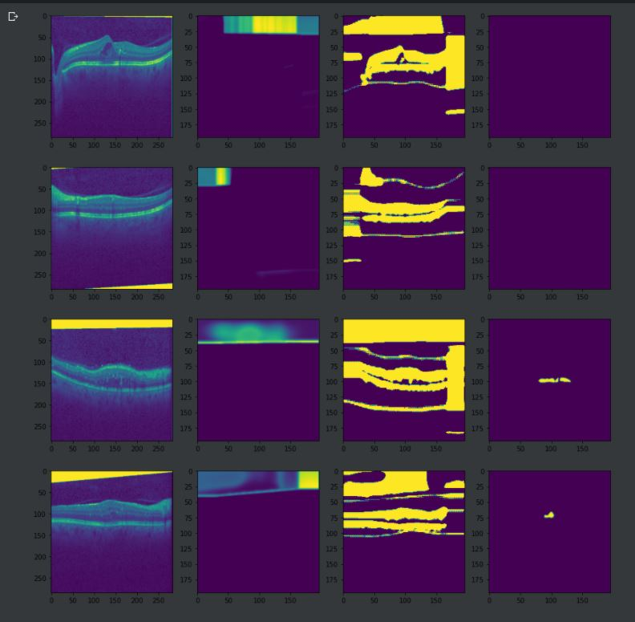
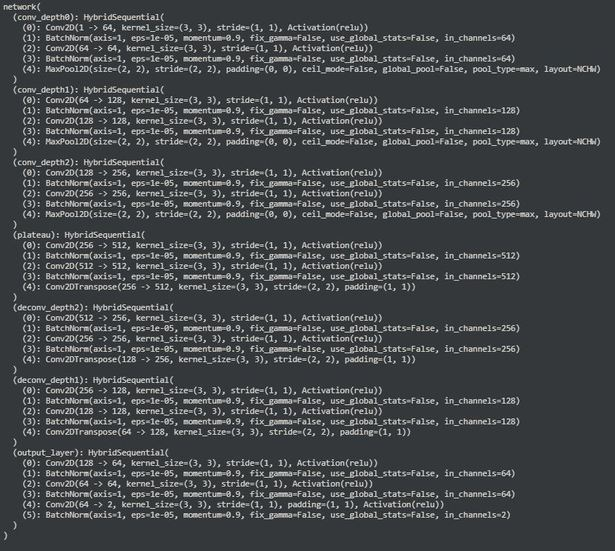
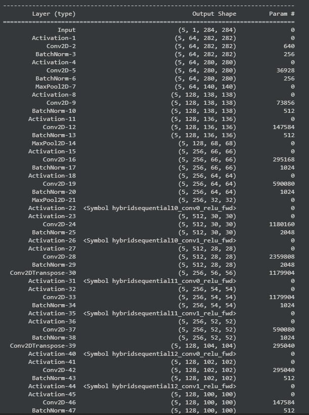
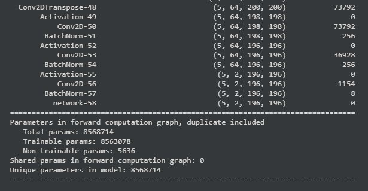

# Segmentation of optical coherence tomography images with diabetic macular edema using UNets. 

Built from scratch using Apache MxNet and Gluon

## Plotting the training examples and the results

                      

## Performance on our validation examples                      
 
                       

## The UNet Structure

                            
 
## Model summary. Input -> ndarray of size (5,1,284,284)                            


             

# Dataset

Images for segmentation of optical coherence tomography images with diabetic macular edema. 
Obtained the dataset from https://www.kaggle.com/paultimothymooney/chiu-2015
I have included the unzipped version of the dataset in this repository

# Installing the requirements
```bash
pip3 install -r requirements.txt
```
# Clone the repository 
```bash
git clone https://github.com/sid0312/OCTImageSegmentation
cd OCTImageSegmentation
```
# Model training
```bash
python train.py
```
# Results
```bash
python results.py
```

To get the intuition of the training process,
go to https://github.com/sid0312/OCTImageSegmentation/blob/master/unets.ipynb

## Made with :heart: by Siddhant Baldota

[](https://github.com/sid0312/) 
[](https://www.linkedin.com/in/siddhant-baldota-051059180/)
